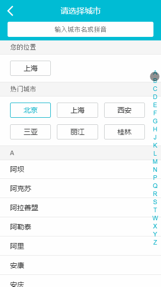

# qnr

#### 项目介绍
vue仿的去哪儿

#### 效果图
- 首页
  

- 列表页
  

- 详情页
  

#### 项目架构
1. vue 2.x框架、vue-cli
2. 用到vue-router、Vuex
3. 滑动插件vue-awesome-swiper 3
4. stylus编写
5. 整体布局用css3 flex

#### 使用说明

1. 运行 npm run dev
2. 访问 lcoalhost:8080

后期会更新更多页面~
